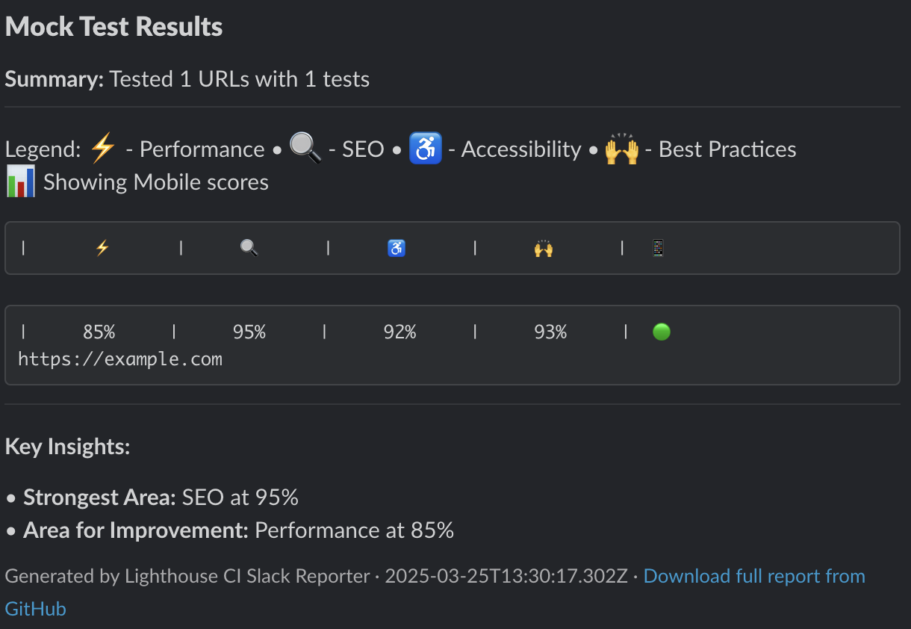

# Lighthouse CI Slack Reporter


[](https://opensource.org/licenses/MIT)
[](https://github.com/MateuszMichalowski/lhci-slack-reporter/blob/main/.github/dependabot.yml)

A powerful GitHub Action that runs Lighthouse tests on specified URLs and reports the results to Slack in a beautifully formatted, tabular layout. Monitor web performance, accessibility, SEO, and best practices directly in your Slack channels.

<div>
  
</div>

## 🚀 Features

- **Multiple URL Testing**: Test single or multiple URLs in one run
- **Device Support**: Run tests for mobile, desktop, or both
- **Full Category Coverage**: Test performance, accessibility, best practices, SEO
- **Beautiful Slack Reports**: Clean, tabular reports with visual indicators
- **Flexible Configuration**: Choose between Slack webhooks or API tokens
- **Score Thresholds**: Set pass/fail criteria based on minimum scores
- **Artifacts**: HTML reports automatically saved as workflow artifacts
- **Customizable**: Options for timeouts, Chrome flags, and retry logic
- **Reliability**: Error handling with retries for flaky tests

## 📋 Quick Start

```yaml
name: Lighthouse CI

on:
  push:
    branches: [ main ]
  # Run weekly on Mondays
  schedule:
    - cron: '0 0 * * 1'

jobs:
  lighthouse:
    runs-on: ubuntu-latest
    steps:
      - uses: actions/checkout@v4
      
      - name: Lighthouse CI Slack Reporter
        uses: MateuszMichalowski/lhci-slack-reporter@v1
        with:
          urls: 'https://example.com,https://example.com/blog'
          slack_webhook_url: ${{ secrets.SLACK_WEBHOOK_URL }}
```

## 🔧 Configuration Options

| Input | Description | Required | Default |
|-------|-------------|----------|---------|
| `urls` | Comma-separated list of URLs to test | ✅ | - |
| `device_types` | Device types to test (mobile, desktop) | ❌ | `mobile,desktop` |
| `categories` | Categories to test (performance, accessibility, best-practices, seo) | ❌ | All categories |
| `slack_webhook_url` | Slack Webhook URL | ✅* | - |
| `slack_token` | Slack API token (alternative to webhook) | ✅* | - |
| `slack_channel` | Slack channel for the report | ❌ | Default from webhook |
| `slack_title` | Title for the Slack message | ❌ | `Lighthouse Test Results` |
| `fail_on_score_below` | Fail action if any score is below this threshold (0-100) | ❌ | `0` |
| `chrome_flags` | Custom Chrome flags | ❌ | `--no-sandbox --headless --disable-gpu` |
| `timeout` | Timeout for each test in seconds | ❌ | `60` |
| `slack_timeout_ms` | Timeout for Slack API calls in milliseconds | ❌ | `10000` |

*Either `slack_webhook_url` or `slack_token` is required

## 📊 Complete Example

```yaml
name: Lighthouse CI

on:
  schedule:
    - cron: '0 9 * * 1-5'  # Weekdays at 9 AM
  workflow_dispatch:  # Allow manual triggering

jobs:
  lighthouse:
    runs-on: ubuntu-latest
    steps:
      - uses: actions/checkout@v4
      
      - name: Lighthouse CI Slack Reporter
        uses: MateuszMichalowski/lhci-slack-reporter@v1
        with:
          # Test multiple URLs
          urls: >
            https://example.com,
            https://example.com/about,
            https://example.com/contact,
            https://example.com/blog
          
          # Test both mobile and desktop
          device_types: 'mobile,desktop'
          
          # Only test these categories
          categories: 'performance,accessibility,best-practices,seo'
          
          # Use Slack webhook (alternatively use slack_token)
          slack_webhook_url: ${{ secrets.SLACK_WEBHOOK_URL }}
          
          # Specify channel (optional if using webhook)
          slack_channel: 'lighthouse-reports'
          
          # Custom title
          slack_title: 'Weekly Lighthouse Results'
          
          # Fail if any score is below 70
          fail_on_score_below: '70'
          
          # Custom Chrome flags
          chrome_flags: '--no-sandbox --headless --disable-gpu --disable-dev-shm-usage'
          
          # Test timeout
          timeout: '90'
```

## 💡 Common Use Cases

### Pull Request Validation

Test pages on a staging environment whenever a PR is created or updated:

```yaml
name: Lighthouse PR Validation

on:
  pull_request:
    branches: [ main, develop ]
    types: [ opened, synchronize, reopened ]

jobs:
  lighthouse:
    runs-on: ubuntu-latest
    steps:
      - uses: actions/checkout@v4
      
      - name: Lighthouse CI Slack Reporter
        uses: MateuszMichalowski/lhci-slack-reporter@v1
        with:
          urls: 'https://staging.example.com'
          slack_webhook_url: ${{ secrets.SLACK_WEBHOOK_URL }}
          slack_title: 'PR #${{ github.event.pull_request.number }} - Lighthouse Results'
          fail_on_score_below: '80'
```

### Scheduled Monitoring

Regular monitoring of production website performance:

```yaml
name: Weekly Lighthouse Monitoring

on:
  schedule:
    - cron: '0 5 * * 1'  # Every Monday at 5 AM

jobs:
  lighthouse:
    runs-on: ubuntu-latest
    steps:
      - uses: actions/checkout@v4
      
      - name: Lighthouse CI Slack Reporter
        uses: MateuszMichalowski/lhci-slack-reporter@v1
        with:
          urls: 'https://example.com,https://example.com/products,https://example.com/blog'
          device_types: 'mobile,desktop'
          slack_webhook_url: ${{ secrets.SLACK_WEBHOOK_URL }}
          slack_channel: 'performance-monitoring'
          slack_title: 'Weekly Performance Report'
```

## 📋 Slack Report Format

The Slack report includes:

- **Header**: Action title and run summary
- **Score Table**: URL-by-URL breakdown of scores in a tabular format
- **Color Coding**:
    - 🟢 Green: 90-100%
    - 🟡 Yellow: 50-89%
    - 🔴 Red: 0-49%
- **Insights**: Strongest and weakest categories
- **Device Comparison**: Performance gap between mobile/desktop
- **Download Links**: Links to full HTML reports when available

## 🧪 Local Testing

You can test this action locally in two ways:

### Using Act

1. Install [act](https://github.com/nektos/act)
2. Create a `.env` file with your Slack webhook URL:
   ```
   SLACK_WEBHOOK_URL=https://hooks.slack.com/services/...
   ```
3. Run the action:
   ```
   ./run-act-local.sh
   ```

### Using the Test Script

```bash
export SLACK_WEBHOOK_URL=https://hooks.slack.com/services/...
chmod +x test-local.sh
./test-local.sh
```

## 🔍 Troubleshooting

### Common Issues

1. **Chrome Crashing**
    - Try adding `--disable-dev-shm-usage` to your Chrome flags
    - Increase the timeout value

2. **Slack Messages Not Sending**
    - Check your webhook URL or token permissions
    - Verify the channel exists and the bot has access

3. **Missing Reports**
    - Ensure your workflow has sufficient permissions to create artifacts
    - Check the logs for error messages

4. **Timeout Errors**
    - Increase the `timeout` parameter for complex pages
    - Test fewer URLs at once

### Debugging

Enable debug logs by setting the GitHub Actions secret `ACTIONS_STEP_DEBUG` to `true`.

## 🤝 Contributing

Contributions are welcome! Please feel free to submit a Pull Request.

1. Fork the repository
2. Create your feature branch (`git checkout -b feature/amazing-feature`)
3. Commit your changes (`git commit -m 'Add some amazing feature'`)
4. Push to the branch (`git push origin feature/amazing-feature`)
5. Open a Pull Request

## 📄 License

This project is licensed under the MIT License - see the [LICENSE](LICENSE) file for details.

## ❓ Need Help?

- Create an issue on this repository
- Check out the [GitHub Actions documentation](https://docs.github.com/en/actions)
- Learn more about [Lighthouse](https://developers.google.com/web/tools/lighthouse)
